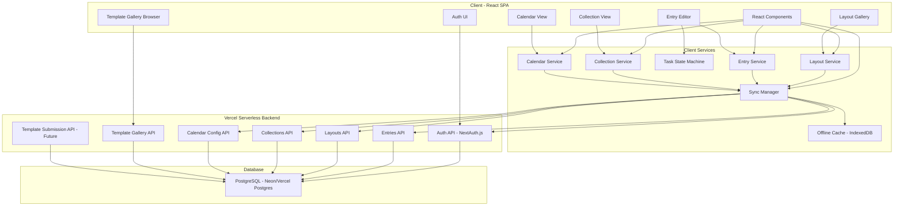
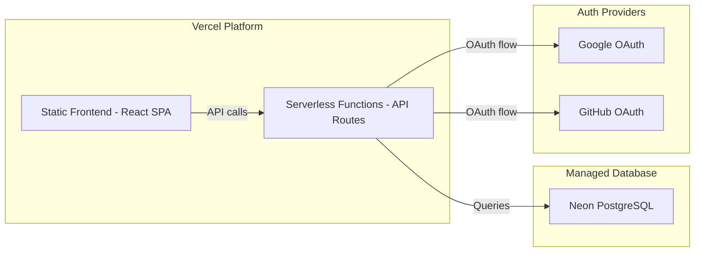

# Design Document: Digital Bullet Journal

## Overview

The Digital Bullet Journal is a full-stack web application that replicates the analog bullet journal methodology in a digital format. Users can create journal pages with customizable layouts, manage tasks with state transitions, log events and notes with signifiers, view entries on a customizable calendar, organize entries into themed collections, and browse a global template gallery.

The application is built as a React + TypeScript single-page application (SPA) with a serverless backend deployed on Vercel. Server-side persistence uses PostgreSQL (via Vercel Postgres or a managed provider like Neon) for user data, authentication, and the global template gallery. The client retains IndexedDB for offline caching and optimistic updates, syncing with the server when connectivity is available.

### Key Design Decisions

- **React + TypeScript frontend**: Strong typing for complex domain models (layouts, entries, collections) and component-based UI. Deployed as a static SPA on Vercel.
- **Vercel serverless functions (API routes)**: Lightweight backend using Next.js API routes or standalone serverless functions. No AWS infrastructure.
- **PostgreSQL database**: Relational database for structured journal data, user accounts, and the template gallery. Hosted via Neon or Vercel Postgres.
- **Authentication via NextAuth.js (Auth.js)**: Supports OAuth providers (Google, GitHub) and email/password. Session-based with JWT tokens for API calls.
- **Hybrid persistence**: Server-side PostgreSQL is the source of truth. IndexedDB provides offline caching and optimistic UI updates, with a sync layer to reconcile.
- **Global template gallery**: A shared, read-only gallery of layouts accessible to all users. Users can submit their own layouts for inclusion (moderated, planned for future).
- **State machine for tasks**: Task state transitions modeled as a finite state machine to enforce valid transitions.
- **Layout engine**: Grid-based layout system with percentage-based content area positioning.

## Architecture

The application follows a layered architecture with a clear client-server boundary.



### Component Responsibilities

- **Client UI Layer**: Renders views, handles user interactions, dispatches actions to client services.
- **Client Services Layer**: Contains business logic, validation, state transitions. Communicates with the backend via the Sync Manager.
- **Sync Manager**: Orchestrates data flow between IndexedDB (offline cache) and the server. Handles optimistic updates, conflict resolution (last-write-wins), and retry logic.
- **Vercel Serverless Backend**: Stateless API routes handling authentication, CRUD operations, and template gallery queries. Each route is a serverless function.
- **PostgreSQL Database**: Source of truth for all user data, preferences, and the global template gallery.

### Deployment Architecture



- **Frontend**: Built and deployed as static assets on Vercel's CDN.
- **Backend**: Serverless functions deployed alongside the frontend on Vercel. Cold starts are minimal for Node.js functions.
- **Database**: Neon PostgreSQL (serverless-friendly, connection pooling built-in). Alternatively, Vercel Postgres (which is Neon under the hood).
- **No AWS**: All infrastructure runs on Vercel + Neon. No Lambda, DynamoDB, S3, or other AWS services.

## Components and Interfaces

### Authentication Service (Server)

```typescript
// Handled by NextAuth.js / Auth.js
// Configuration defines providers and session strategy

interface AuthConfig {
  providers: ['google', 'github', 'credentials'];
  session: { strategy: 'jwt' };
  database: PostgresAdapter;
}

interface User {
  id: string;
  email: string;
  name: string;
  image?: string;
  createdAt: Date;
}

interface Session {
  user: User;
  accessToken: string;
  expiresAt: Date;
}
```

### Layout Service (Client)

```typescript
interface LayoutService {
  getBuiltInLayouts(): Layout[];
  getCustomLayouts(): Promise<Layout[]>;
  getAllLayouts(): Promise<Layout[]>;
  createCustomLayout(layout: Omit<Layout, 'id' | 'createdAt'>): Promise<Layout>;
  updateCustomLayout(id: string, changes: Partial<Layout>): Promise<Layout>;
  deleteCustomLayout(id: string): Promise<void>;
  validateLayout(layout: Layout): ValidationResult;
}

interface ValidationResult {
  valid: boolean;
  errors: string[];
}
```

### Entry Service (Client)

```typescript
interface EntryService {
  createEntry(entry: Omit<Entry, 'id' | 'createdAt'>): Promise<Entry>;
  updateEntry(id: string, changes: Partial<Entry>): Promise<Entry>;
  deleteEntry(id: string): Promise<void>;
  getEntriesByPage(pageId: string): Promise<Entry[]>;
  getEntriesByDateRange(start: Date, end: Date): Promise<Entry[]>;
  validateEntry(entry: Entry): ValidationResult;
}
```

### Task State Machine (Client)

```typescript
interface TaskStateMachine {
  transition(currentState: TaskState, action: TaskAction): TaskState | null;
  getValidActions(currentState: TaskState): TaskAction[];
  isTerminalState(state: TaskState): boolean;
}

type TaskState = 'incomplete' | 'complete' | 'migrated' | 'cancelled';
type TaskAction = 'complete' | 'migrate' | 'cancel';
```

### Collection Service (Client)

```typescript
interface CollectionService {
  createCollection(collection: Omit<Collection, 'id' | 'createdAt'>): Promise<Collection>;
  updateCollection(id: string, changes: Partial<Collection>): Promise<Collection>;
  deleteCollection(id: string): Promise<void>;
  addEntryToCollection(entryId: string, collectionId: string): Promise<void>;
  removeEntryFromCollection(entryId: string, collectionId: string): Promise<void>;
  getCollectionEntries(collectionId: string): Promise<CollectionEntry[]>;
  getCollectionsForEntry(entryId: string): Promise<Collection[]>;
}
```

### Calendar Service (Client)

```typescript
interface CalendarService {
  getEntriesForPeriod(period: CalendarPeriod): Promise<Entry[]>;
  getCalendarConfig(): Promise<CalendarConfig>;
  updateCalendarConfig(config: Partial<CalendarConfig>): Promise<CalendarConfig>;
}

type CalendarPeriodType = 'daily' | 'weekly' | 'monthly';

interface CalendarPeriod {
  type: CalendarPeriodType;
  startDate: Date;
  endDate: Date;
}
```

### Template Gallery Service (Client)

```typescript
interface TemplateGalleryService {
  browseTemplates(filters?: TemplateFilters): Promise<GalleryTemplate[]>;
  getTemplateById(id: string): Promise<GalleryTemplate | null>;
  useTemplate(templateId: string): Promise<Layout>;
  submitTemplate(layout: Layout, metadata: TemplateSubmissionMetadata): Promise<TemplateSubmission>;
}

interface TemplateFilters {
  category?: TemplateCategory;
  search?: string;
  sortBy?: 'popular' | 'newest' | 'name';
}

type TemplateCategory = 'daily' | 'weekly' | 'monthly' | 'tracker' | 'creative' | 'planning' | 'other';

interface TemplateSubmissionMetadata {
  description: string;       // 1-300 characters
  category: TemplateCategory;
  tags: string[];            // max 5 tags, each 1-30 characters
}
```

### Sync Manager (Client)

```typescript
interface SyncManager {
  pushChanges(): Promise<SyncResult>;
  pullChanges(since: Date): Promise<SyncResult>;
  getStatus(): SyncStatus;
  resolveConflict(conflictId: string, resolution: 'local' | 'remote'): Promise<void>;
}

type SyncStatus = 'synced' | 'syncing' | 'offline' | 'conflict' | 'error';

interface SyncResult {
  pushed: number;
  pulled: number;
  conflicts: SyncConflict[];
}

interface SyncConflict {
  id: string;
  entityType: string;
  entityId: string;
  localVersion: unknown;
  remoteVersion: unknown;
}
```

### Server API Routes

```typescript
// All routes require authentication (JWT in Authorization header)
// Base path: /api

// Auth
// POST /api/auth/[...nextauth] — handled by NextAuth.js

// Entries
// GET    /api/entries?pageId=X | dateStart=X&dateEnd=Y
// POST   /api/entries
// PUT    /api/entries/:id
// DELETE /api/entries/:id

// Layouts
// GET    /api/layouts
// POST   /api/layouts
// PUT    /api/layouts/:id
// DELETE /api/layouts/:id

// Collections
// GET    /api/collections
// POST   /api/collections
// PUT    /api/collections/:id
// DELETE /api/collections/:id
// POST   /api/collections/:id/entries
// DELETE /api/collections/:id/entries/:entryId

// Calendar Config
// GET    /api/calendar-config
// PUT    /api/calendar-config

// Template Gallery (public read, authenticated write)
// GET    /api/templates?category=X&search=Y&sort=Z  (public)
// GET    /api/templates/:id                          (public)
// POST   /api/templates/submit                       (authenticated, future)

// User Preferences
// GET    /api/preferences
// PUT    /api/preferences
```

### Persistence Layer (Client - Offline Cache)

```typescript
interface Repository<T> {
  getById(id: string): Promise<T | null>;
  getAll(): Promise<T[]>;
  create(item: T): Promise<T>;
  update(id: string, item: Partial<T>): Promise<T>;
  delete(id: string): Promise<void>;
  query(predicate: (item: T) => boolean): Promise<T[]>;
}

interface SaveQueue {
  enqueue(operation: SaveOperation): void;
  getStatus(): SaveStatus;
  retry(operationId: string): Promise<void>;
}

type SaveStatus = 'idle' | 'saving' | 'retrying' | 'failed';

interface SaveOperation {
  id: string;
  type: 'create' | 'update' | 'delete';
  entity: string;
  data: unknown;
  attempts: number;
  maxAttempts: number;
  retryDelayMs: number;
}
```

## Data Models

```typescript
// === User & Auth ===

interface User {
  id: string;                      // UUID
  email: string;
  name: string;
  image?: string;
  createdAt: Date;
  updatedAt: Date;
}

interface UserPreferences {
  id: string;
  userId: string;
  defaultLayoutId?: string;
  theme: 'light' | 'dark' | 'system';
  createdAt: Date;
  updatedAt: Date;
}

// === Core Entities ===

interface Layout {
  id: string;
  userId: string;                  // owner
  name: string;                    // 1-50 characters
  isBuiltIn: boolean;
  contentAreas: ContentArea[];     // 1-20 areas
  createdAt: Date;
  updatedAt: Date;
}

interface ContentArea {
  id: string;
  type: ContentAreaType;
  x: number;                       // percentage 0-100
  y: number;                       // percentage 0-100
  width: number;                   // percentage 5-100
  height: number;                  // percentage 5-100
}

type ContentAreaType = 'text' | 'checklist' | 'image' | 'blank';

interface JournalPage {
  id: string;
  userId: string;
  layoutId: string;
  title: string;
  createdAt: Date;
  updatedAt: Date;
}

interface Entry {
  id: string;
  userId: string;
  pageId: string;
  type: EntryType;
  text: string;                    // 1-500 characters
  signifiers: Signifier[];         // max 3: at most 1 priority + up to 2 category
  date?: Date;                     // required for Events, optional for Tasks
  state?: TaskState;               // only for Tasks
  createdAt: Date;
  updatedAt: Date;
}

type EntryType = 'task' | 'event' | 'note';

type TaskState = 'incomplete' | 'complete' | 'migrated' | 'cancelled';

interface Signifier {
  id: string;
  symbol: string;
  category: 'type' | 'priority' | 'category';
  label: string;
}

interface Collection {
  id: string;
  userId: string;
  name: string;                    // 1-100 characters
  layoutId: string;
  isTemplate: boolean;
  templateType?: 'habit-tracker' | 'reading-list' | 'goal-tracking';
  createdAt: Date;
  updatedAt: Date;
}

interface CollectionEntry {
  collectionId: string;
  entryId: string;
  addedAt: Date;
}

interface CalendarConfig {
  id: string;
  userId: string;
  weekStartDay: WeekDay;          // default: 'monday'
  colorTheme: string;
  layoutDensity: LayoutDensity;
  visibleEntryTypes: EntryType[];  // default: all types
  customSizing?: CalendarSizing;
}

type WeekDay = 'monday' | 'tuesday' | 'wednesday' | 'thursday' | 'friday' | 'saturday' | 'sunday';
type LayoutDensity = 'compact' | 'standard' | 'expanded';

interface CalendarSizing {
  areas: { id: string; widthPercent: number; heightPercent: number }[];
}

// === Template Gallery ===

interface GalleryTemplate {
  id: string;
  name: string;                    // 1-50 characters
  description: string;             // 1-300 characters
  category: TemplateCategory;
  tags: string[];                  // max 5 tags
  contentAreas: ContentArea[];
  previewImageUrl?: string;
  authorId?: string;               // null for system templates
  authorName: string;
  usageCount: number;
  isFeatured: boolean;
  status: TemplateStatus;
  createdAt: Date;
  updatedAt: Date;
}

type TemplateCategory = 'daily' | 'weekly' | 'monthly' | 'tracker' | 'creative' | 'planning' | 'other';
type TemplateStatus = 'published' | 'pending_review' | 'rejected' | 'draft';

interface TemplateSubmission {
  id: string;
  userId: string;
  templateId: string;
  layoutId: string;                // source layout being submitted
  description: string;
  category: TemplateCategory;
  tags: string[];
  status: TemplateStatus;
  reviewNotes?: string;
  submittedAt: Date;
  reviewedAt?: Date;
}

// === Sync & Persistence ===

interface SyncMetadata {
  entityType: string;
  entityId: string;
  lastSyncedAt: Date;
  localVersion: number;
  serverVersion: number;
  isDirty: boolean;
}

interface PersistenceState {
  hasUnsavedChanges: boolean;
  pendingOperations: SaveOperation[];
  lastSyncedAt: Date | null;
  syncStatus: SyncStatus;
}
```

### PostgreSQL Schema

```sql
-- Users (managed by NextAuth.js adapter)
CREATE TABLE users (
  id UUID PRIMARY KEY DEFAULT gen_random_uuid(),
  email VARCHAR(255) UNIQUE NOT NULL,
  name VARCHAR(255),
  image TEXT,
  email_verified TIMESTAMP,
  created_at TIMESTAMP DEFAULT NOW(),
  updated_at TIMESTAMP DEFAULT NOW()
);

-- User Preferences
CREATE TABLE user_preferences (
  id UUID PRIMARY KEY DEFAULT gen_random_uuid(),
  user_id UUID REFERENCES users(id) ON DELETE CASCADE,
  default_layout_id UUID,
  theme VARCHAR(20) DEFAULT 'system',
  created_at TIMESTAMP DEFAULT NOW(),
  updated_at TIMESTAMP DEFAULT NOW(),
  UNIQUE(user_id)
);

-- Layouts
CREATE TABLE layouts (
  id UUID PRIMARY KEY DEFAULT gen_random_uuid(),
  user_id UUID REFERENCES users(id) ON DELETE CASCADE,
  name VARCHAR(50) NOT NULL,
  is_built_in BOOLEAN DEFAULT FALSE,
  content_areas JSONB NOT NULL,
  created_at TIMESTAMP DEFAULT NOW(),
  updated_at TIMESTAMP DEFAULT NOW(),
  UNIQUE(user_id, name)
);

-- Journal Pages
CREATE TABLE journal_pages (
  id UUID PRIMARY KEY DEFAULT gen_random_uuid(),
  user_id UUID REFERENCES users(id) ON DELETE CASCADE,
  layout_id UUID REFERENCES layouts(id) ON DELETE SET NULL,
  title VARCHAR(255),
  created_at TIMESTAMP DEFAULT NOW(),
  updated_at TIMESTAMP DEFAULT NOW()
);

-- Entries
CREATE TABLE entries (
  id UUID PRIMARY KEY DEFAULT gen_random_uuid(),
  user_id UUID REFERENCES users(id) ON DELETE CASCADE,
  page_id UUID REFERENCES journal_pages(id) ON DELETE CASCADE,
  type VARCHAR(10) NOT NULL CHECK (type IN ('task', 'event', 'note')),
  text VARCHAR(500) NOT NULL,
  signifiers JSONB DEFAULT '[]',
  date DATE,
  state VARCHAR(20) CHECK (state IN ('incomplete', 'complete', 'migrated', 'cancelled')),
  created_at TIMESTAMP DEFAULT NOW(),
  updated_at TIMESTAMP DEFAULT NOW()
);

-- Collections
CREATE TABLE collections (
  id UUID PRIMARY KEY DEFAULT gen_random_uuid(),
  user_id UUID REFERENCES users(id) ON DELETE CASCADE,
  name VARCHAR(100) NOT NULL,
  layout_id UUID REFERENCES layouts(id) ON DELETE SET NULL,
  is_template BOOLEAN DEFAULT FALSE,
  template_type VARCHAR(30),
  created_at TIMESTAMP DEFAULT NOW(),
  updated_at TIMESTAMP DEFAULT NOW()
);

-- Collection Entries (junction table)
CREATE TABLE collection_entries (
  collection_id UUID REFERENCES collections(id) ON DELETE CASCADE,
  entry_id UUID REFERENCES entries(id) ON DELETE CASCADE,
  added_at TIMESTAMP DEFAULT NOW(),
  PRIMARY KEY (collection_id, entry_id)
);

-- Calendar Config
CREATE TABLE calendar_configs (
  id UUID PRIMARY KEY DEFAULT gen_random_uuid(),
  user_id UUID REFERENCES users(id) ON DELETE CASCADE,
  week_start_day VARCHAR(10) DEFAULT 'monday',
  color_theme VARCHAR(50) DEFAULT 'default',
  layout_density VARCHAR(10) DEFAULT 'standard',
  visible_entry_types JSONB DEFAULT '["task", "event", "note"]',
  custom_sizing JSONB,
  created_at TIMESTAMP DEFAULT NOW(),
  updated_at TIMESTAMP DEFAULT NOW(),
  UNIQUE(user_id)
);

-- Template Gallery
CREATE TABLE gallery_templates (
  id UUID PRIMARY KEY DEFAULT gen_random_uuid(),
  name VARCHAR(50) NOT NULL,
  description VARCHAR(300) NOT NULL,
  category VARCHAR(20) NOT NULL,
  tags JSONB DEFAULT '[]',
  content_areas JSONB NOT NULL,
  preview_image_url TEXT,
  author_id UUID REFERENCES users(id) ON DELETE SET NULL,
  author_name VARCHAR(255) NOT NULL,
  usage_count INTEGER DEFAULT 0,
  is_featured BOOLEAN DEFAULT FALSE,
  status VARCHAR(20) DEFAULT 'published',
  created_at TIMESTAMP DEFAULT NOW(),
  updated_at TIMESTAMP DEFAULT NOW()
);

-- Template Submissions (future)
CREATE TABLE template_submissions (
  id UUID PRIMARY KEY DEFAULT gen_random_uuid(),
  user_id UUID REFERENCES users(id) ON DELETE CASCADE,
  template_id UUID REFERENCES gallery_templates(id) ON DELETE SET NULL,
  layout_id UUID REFERENCES layouts(id) ON DELETE SET NULL,
  description VARCHAR(300) NOT NULL,
  category VARCHAR(20) NOT NULL,
  tags JSONB DEFAULT '[]',
  status VARCHAR(20) DEFAULT 'pending_review',
  review_notes TEXT,
  submitted_at TIMESTAMP DEFAULT NOW(),
  reviewed_at TIMESTAMP
);

-- Indexes
CREATE INDEX idx_entries_user_page ON entries(user_id, page_id);
CREATE INDEX idx_entries_user_date ON entries(user_id, date);
CREATE INDEX idx_entries_user_type ON entries(user_id, type);
CREATE INDEX idx_layouts_user ON layouts(user_id);
CREATE INDEX idx_collections_user ON collections(user_id);
CREATE INDEX idx_gallery_templates_category ON gallery_templates(category);
CREATE INDEX idx_gallery_templates_status ON gallery_templates(status);
CREATE INDEX idx_gallery_templates_featured ON gallery_templates(is_featured);
```

### IndexedDB Schema (Offline Cache)

The client-side IndexedDB database `digital-bullet-journal-cache` mirrors server data for offline access:

| Store | Key Path | Indexes | Purpose |
|-------|----------|---------|---------|
| `layouts` | `id` | `name`, `isBuiltIn` | Cached user layouts |
| `journalPages` | `id` | `layoutId`, `createdAt` | Cached pages |
| `entries` | `id` | `pageId`, `type`, `date`, `state` | Cached entries |
| `collections` | `id` | `name`, `isTemplate` | Cached collections |
| `collectionEntries` | `[collectionId, entryId]` | `collectionId`, `entryId` | Cached links |
| `calendarConfig` | `id` | — | Cached config |
| `syncMetadata` | `[entityType, entityId]` | `isDirty`, `lastSyncedAt` | Sync tracking |
| `galleryTemplatesCache` | `id` | `category`, `isFeatured` | Cached gallery |


## Correctness Properties

*A property is a characteristic or behavior that should hold true across all valid executions of a system — essentially, a formal statement about what the system should do. Properties serve as the bridge between human-readable specifications and machine-verifiable correctness guarantees.*

### Property 1: Layout validation enforces content area constraints

*For any* layout configuration, the layout validator should accept it if and only if it has between 1 and 20 content areas, each with width and height between 5% and 100%, and each with a valid content area type (text, checklist, image, blank).

**Validates: Requirements 2.1, 2.2**

### Property 2: Layout name length validation

*For any* string, the layout name validator should accept it if and only if its trimmed length is between 1 and 50 characters (inclusive).

**Validates: Requirements 2.5**

### Property 3: Layout name uniqueness enforcement

*For any* set of existing layouts belonging to a user and a new layout name, saving a layout with a name that matches an existing layout's name (case-insensitive) should fail with a naming conflict error.

**Validates: Requirements 2.6**

### Property 4: Layout persistence round-trip

*For any* valid custom layout, saving it via the API and then retrieving it by ID should produce a layout with equivalent name, content areas, and metadata.

**Validates: Requirements 2.3**

### Property 5: Layout deletion preserves journal pages

*For any* custom layout that has associated journal pages, deleting the layout should remove it from the layout gallery while all journal pages referencing that layout's ID remain retrievable and unchanged.

**Validates: Requirements 2.7**

### Property 6: Task state machine correctness

*For any* task state and action pair, the state machine should: (a) transition from 'incomplete' to 'complete' on the 'complete' action, to 'migrated' on the 'migrate' action, and to 'cancelled' on the 'cancel' action; (b) return null/reject for any action applied to a non-incomplete state (complete, migrated, or cancelled); (c) assign 'incomplete' as the initial state for any newly created task.

**Validates: Requirements 3.1, 3.2, 3.4, 3.5, 3.6**

### Property 7: Task migration produces correct results

*For any* task in the incomplete state and any valid target journal page, migrating the task should produce: (a) a new entry on the target page with the same text, type 'task', and state 'incomplete'; and (b) the original entry updated to state 'migrated' with a migration signifier.

**Validates: Requirements 3.3**

### Property 8: Entry validation correctness

*For any* entry data, entry validation should: (a) reject if the type field is missing or not one of 'task', 'event', 'note'; (b) reject if the text is empty, whitespace-only, or exceeds 500 characters; (c) accept if the type is valid and the trimmed text length is between 1 and 500 characters.

**Validates: Requirements 4.1, 4.5, 4.6**

### Property 9: Signifier composition constraints

*For any* combination of signifiers attached to an entry, validation should pass if and only if the total count is at most 3, the number of priority signifiers is at most 1, and the number of category signifiers is at most 2.

**Validates: Requirements 4.4**

### Property 10: Calendar period filtering returns correct entries

*For any* set of entries with dates and any calendar period (daily, weekly, or monthly), querying entries for that period should return exactly those entries whose date falls within the period's start and end dates (inclusive), and no others.

**Validates: Requirements 5.2**

### Property 11: Calendar period navigation round-trip

*For any* calendar period, navigating to the next period and then back to the previous period should return to the original period's start and end dates.

**Validates: Requirements 5.4**

### Property 12: Week start day determines weekly period boundaries

*For any* configured week start day and any date, the weekly calendar period containing that date should start on the configured week start day and span exactly 7 days.

**Validates: Requirements 6.1**

### Property 13: Entry type visibility filtering

*For any* set of entries and any subset of visible entry types in the calendar configuration, the filtered calendar results should contain exactly those entries whose type is in the visible set, excluding all entries whose type is not in the visible set.

**Validates: Requirements 6.4**

### Property 14: Calendar sizing constraints

*For any* sizing value applied to a calendar content area, the system should constrain the value to be at least 10% and at most 90% of the available dimension. Values below 10% should be clamped to 10%, and values above 90% should be clamped to 90%.

**Validates: Requirements 6.6**

### Property 15: Collection name length validation

*For any* string, the collection name validator should accept it if and only if its trimmed length is between 1 and 100 characters (inclusive).

**Validates: Requirements 7.1**

### Property 16: Collection link limit enforcement

*For any* entry already linked to 10 collections, attempting to link it to an additional collection should fail. For any entry linked to fewer than 10 collections, linking to an additional collection should succeed.

**Validates: Requirements 7.2**

### Property 17: Collection entries sorted by addition date

*For any* collection with linked entries, retrieving the collection's entries should return them sorted in ascending order by the date each entry was added to the collection.

**Validates: Requirements 7.3**

### Property 18: Unlinking entry from collection preserves the entry

*For any* entry linked to a collection, removing the entry from the collection should leave the entry intact and retrievable from its source journal page with all its data unchanged.

**Validates: Requirements 7.5**

### Property 19: Entry deletion cascades to all collection links

*For any* entry linked to N collections (where N ≥ 1), deleting the entry from its source journal page should remove all N collection-entry links, and the entry should no longer appear in any collection view.

**Validates: Requirements 7.6**

### Property 20: Data persistence round-trip (client restore)

*For any* valid app state (entries, custom layouts, calendar config, collections), persisting the state to the server and then restoring it on app reload should produce an equivalent state with all data intact.

**Validates: Requirements 8.3**

### Property 21: Save retry logic

*For any* failed save operation, the retry manager should attempt exactly up to 3 retries before marking the operation as permanently failed. The number of total attempts should never exceed 4 (1 initial + 3 retries).

**Validates: Requirements 8.4**

### Property 22: Unsaved changes indicator accuracy

*For any* persistence state, the hasUnsavedChanges flag should be true if and only if there is at least one pending save operation in the queue.

**Validates: Requirements 8.6**

### Property 23: Server-side persistence round-trip (API)

*For any* valid entity (entry, layout, collection, calendar config), creating it via the API (POST) and then retrieving it (GET) should produce an entity with equivalent data fields.

**Validates: Requirements 8.3**

### Property 24: API authorization isolation

*For any* authenticated user and any entity belonging to a different user, API requests to read, update, or delete that entity should be rejected with a 403 Forbidden response, and the entity should remain unchanged.

**Validates: Requirements 8.3**

### Property 25: Template gallery filtering correctness

*For any* set of published gallery templates and any filter criteria (category, search term, sort order), the returned results should: (a) only include templates matching the category filter (if specified); (b) only include templates whose name or description contains the search term (if specified); (c) be sorted according to the specified sort order.

**Validates: Requirements 1.1**

### Property 26: Using a template creates an equivalent layout

*For any* published gallery template, when a user "uses" that template, the system should create a new layout in the user's account with content areas equivalent to the template's content areas, and the template's usage count should increment by 1.

**Validates: Requirements 1.4**

### Property 27: Template submission creates a pending review entry

*For any* valid layout owned by a user and valid submission metadata (description 1-300 chars, category valid, tags ≤ 5 each 1-30 chars), submitting the layout to the gallery should create a template submission with status 'pending_review' and should NOT immediately publish the template.

**Validates: Requirements 2.3**

### Property 28: Sync manager pushes all dirty entities

*For any* set of entities marked as dirty in the local IndexedDB cache, triggering a sync should attempt to push all dirty entities to the server, and upon success, mark them as clean (isDirty = false) with updated lastSyncedAt timestamps.

**Validates: Requirements 8.1, 8.2**
**Validates: Requirements 8.1, 8.2 (sync correctness)**

## Error Handling

### Validation Errors

| Context | Error Condition | Behavior |
|---------|----------------|----------|
| Layout name | Empty or >50 chars | Display inline error, retain form state |
| Layout name | Duplicate name (per user) | Display "name already exists" error, retain form state |
| Layout content areas | >20 areas or size out of bounds | Prevent addition/resize, show constraint message |
| Entry text | Empty/whitespace or >500 chars | Prevent save, display "text required" or "text too long" |
| Entry type | Not specified | Prevent save, prompt type selection |
| Signifiers | >3 total, >1 priority, >2 category | Prevent addition, show limit message |
| Collection name | Empty or >100 chars | Display inline error, retain form state |
| Collection link | Entry already in 10 collections | Display limit reached message |
| Calendar sizing | Value outside 10-90% | Clamp to nearest valid value |
| Template submission description | Empty or >300 chars | Display inline error |
| Template submission tags | >5 tags or tag >30 chars | Prevent addition, show limit message |

### Authentication Errors

| Error | Behavior |
|-------|----------|
| Invalid credentials | Display "invalid email or password" message |
| OAuth provider error | Display provider-specific error, offer retry |
| Session expired | Redirect to login, preserve current page URL for post-login redirect |
| Unauthorized API request | Return 401, client redirects to login |
| Forbidden (cross-user access) | Return 403, display "access denied" message |

### Persistence & Sync Errors

| Error | Behavior |
|-------|----------|
| API request failure (network) | Queue operation locally, show "offline" indicator, retry on reconnect |
| API request failure (server error) | Show notification, enqueue retry (up to 3 attempts, 5s delay) |
| All retries exhausted | Show persistent warning, retain data in IndexedDB |
| Sync conflict (concurrent edit) | Apply last-write-wins strategy, notify user of conflict resolution |
| Database connection failure (server) | Return 503, client retries with exponential backoff |
| IndexedDB unavailable | Fall back to in-memory cache, warn user about offline limitations |
| Storage quota exceeded | Show storage warning, suggest clearing old cached data |

### State Machine Errors

Invalid state transitions (e.g., completing an already-completed task) are silently rejected by the state machine returning `null`. The UI should not present invalid actions to the user — `getValidActions()` determines which buttons/options are shown.

## Testing Strategy

### Property-Based Testing

**Library**: [fast-check](https://github.com/dubzzz/fast-check) (TypeScript property-based testing library)

**Configuration**: Minimum 100 iterations per property test.

**Tag format**: `Feature: digital-bullet-journal, Property {number}: {property_text}`

Property-based tests will cover all 28 correctness properties defined above, organized by domain:

- **Layout validation** (Properties 1-5): Generate random content area configurations, names, and layout states
- **Task state machine** (Properties 6-7): Generate random state/action pairs and migration scenarios
- **Entry validation** (Properties 8-9): Generate random entry data, signifier combinations, text strings
- **Calendar logic** (Properties 10-14): Generate random dates, periods, entry sets, and configurations
- **Collection logic** (Properties 15-19): Generate random collection states, link counts, entry sets
- **Persistence & sync** (Properties 20-23, 28): Generate random app states, save operation sequences, and dirty entity sets
- **API authorization** (Property 24): Generate random user/entity pairs, verify cross-user access rejection
- **Template gallery** (Properties 25-27): Generate random template sets, filter criteria, and submission data

### Unit Tests (Example-Based)

Unit tests complement property tests for specific scenarios:
- Built-in layouts include daily log, weekly spread, monthly log, blank page (Req 1.2)
- Default signifier mapping: bullet for tasks, circle for events, dash for notes (Req 4.2)
- Pre-built collection templates exist (habit tracker, reading list, goal tracking) (Req 7.4)
- Calendar provides 3+ built-in color themes (Req 6.3)
- Gallery dismissal does not create a page (Req 1.5)
- All retry attempts exhausted shows persistent warning (Req 8.5)
- Template gallery displays search interface on page load
- Empty search results suggest alternatives

### Integration Tests

Integration tests verify API interactions, database operations, and timing requirements:
- Authentication flow with mocked OAuth providers
- Entry persistence completes within 2 seconds (Req 8.1)
- Layout/config persistence completes within 5 seconds (Req 8.2)
- Layout gallery renders within 1 second (Req 1.1)
- Calendar updates within 2 seconds of entry addition (Req 5.3)
- Theme application reflects within 2 seconds (Req 6.2)
- End-to-end sync flow: create offline → go online → verify server has data
- Template gallery API returns paginated results
- Template submission creates database record with correct status

### Test Organization

```
tests/
├── properties/           # Property-based tests (fast-check)
│   ├── layout.property.test.ts
│   ├── taskStateMachine.property.test.ts
│   ├── entry.property.test.ts
│   ├── calendar.property.test.ts
│   ├── collection.property.test.ts
│   ├── persistence.property.test.ts
│   ├── sync.property.test.ts
│   ├── api-auth.property.test.ts
│   └── templateGallery.property.test.ts
├── unit/                 # Example-based unit tests
│   ├── layout.test.ts
│   ├── entry.test.ts
│   ├── calendar.test.ts
│   ├── collection.test.ts
│   └── templateGallery.test.ts
└── integration/          # API, database, and timing tests
    ├── auth.integration.test.ts
    ├── persistence.integration.test.ts
    ├── sync.integration.test.ts
    ├── templateGallery.integration.test.ts
    └── performance.integration.test.ts
```
