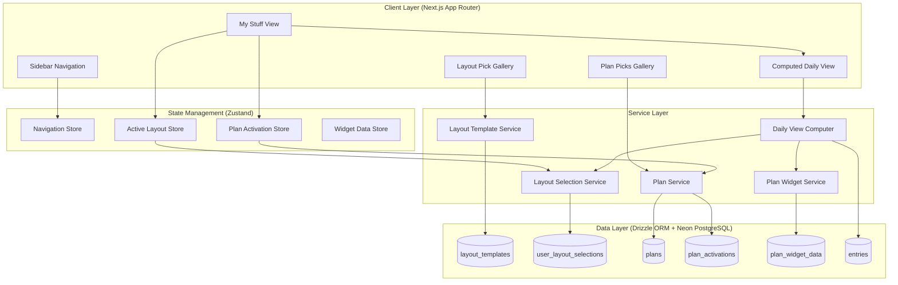
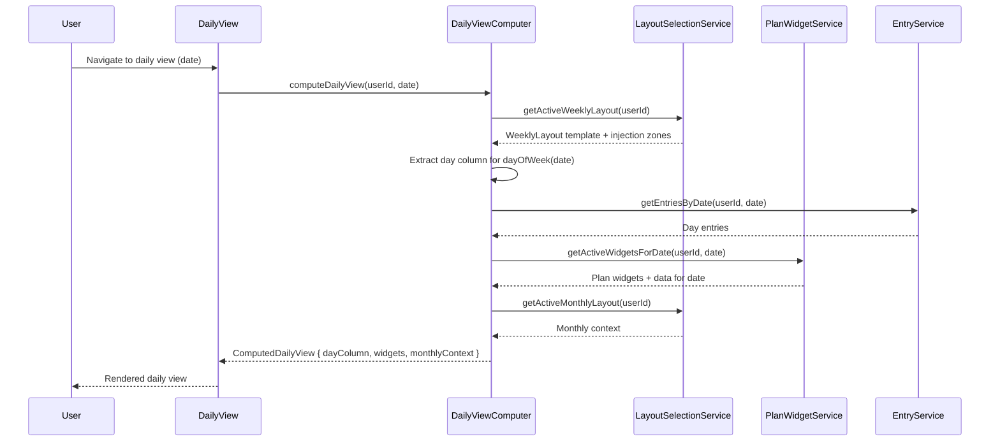

# Design Document: Layout Plan System

## Overview

The Layout Plan System restructures the digital bullet journal around three navigational pillars: **My Stuff** (the user's active workspace), **Layout Pick** (a template gallery), and **Plan Picks** (composable add-ons). It introduces a template-driven architecture where users select layout templates that define visual structure, and layer plan add-ons that inject widgets into designated injection zones within those templates.

The central innovation is the **Computed Daily View** — a derived view that extracts the current day's column from the active weekly layout, merges all active plan widgets for that day, and includes relevant monthly context, giving users a focused single-day perspective without duplicating data.

### Key Design Decisions

1. **Template vs Instance separation**: Layout templates are immutable definitions; user layout selections create an association without copying the template. This keeps templates shareable and updatable.
2. **Injection zones over slot replacement**: Plan widgets inject into named zones within templates rather than replacing template areas. Multiple plans can coexist by stacking within zones.
3. **Computed daily view (not stored)**: The daily view is computed at render time from weekly layout data + plan widgets + monthly context. No separate "daily" records exist.
4. **Plan data independence**: Plan widget data is stored separately from entries, keyed by plan ID + date + widget type. Deactivating a plan hides widgets without deleting data.

## Architecture



### Data Flow for Computed Daily View



## Components and Interfaces

### Navigation Components

```typescript
// Sidebar with three-section navigation
interface SidebarProps {
  activeSection: 'my-stuff' | 'layout-pick' | 'plan-picks';
  onSectionChange: (section: SidebarProps['activeSection']) => void;
}

// View switcher within My Stuff
interface ViewSwitcherProps {
  activeView: 'weekly' | 'monthly' | 'daily';
  onViewChange: (view: ViewSwitcherProps['activeView']) => void;
  currentDate: Date;
}
```

### Layout Template Components

```typescript
interface LayoutTemplateGalleryProps {
  templates: LayoutTemplate[];
  activeWeeklyId?: string;
  activeMonthlyId?: string;
  categoryFilter?: LayoutCategory;
  searchTerm?: string;
  onSelectTemplate: (templateId: string) => void;
  onFilterChange: (category: LayoutCategory | null) => void;
  onSearchChange: (term: string) => void;
}

interface LayoutTemplateCardProps {
  template: LayoutTemplate;
  isActive: boolean;
  onSelect: () => void;
}
```

### Plan Components

```typescript
interface PlanGalleryProps {
  plans: Plan[];
  activePlanIds: string[];
  onActivatePlan: (planId: string) => void;
  onDeactivatePlan: (planId: string) => void;
}

interface PlanCardProps {
  plan: Plan;
  isActive: boolean;
  onToggle: () => void;
}

interface PlanWidgetRendererProps {
  widget: PlanWidgetDefinition;
  data: PlanWidgetDataRecord | null;
  date: Date;
  onDataChange: (value: string) => void;
}
```

### View Components

```typescript
interface WeeklyLayoutViewProps {
  template: LayoutTemplate;
  weekStartDate: Date;
  entries: Entry[];
  activeWidgets: InjectedWidget[];
  onCreateEntry: (date: Date, text: string, type: EntryType) => void;
  onWidgetDataChange: (widgetId: string, date: Date, value: string) => void;
  onNavigateWeek: (direction: 'prev' | 'next') => void;
}

interface MonthlyLayoutViewProps {
  template: LayoutTemplate;
  monthDate: Date;
  entries: Entry[];
  activeWidgets: InjectedWidget[];
  onCreateEntry: (date: Date, text: string, type: EntryType) => void;
  onWidgetDataChange: (widgetId: string, date: Date, value: string) => void;
  onNavigateMonth: (direction: 'prev' | 'next') => void;
}

interface DailyViewProps {
  computedView: ComputedDailyView;
  date: Date;
  onCreateEntry: (text: string, type: EntryType) => void;
  onWidgetDataChange: (widgetId: string, value: string) => void;
  onNavigateDay: (direction: 'prev' | 'next') => void;
}
```

### Service Interfaces

```typescript
interface LayoutTemplateService {
  getAllTemplates(): Promise<LayoutTemplate[]>;
  getTemplatesByCategory(category: LayoutCategory): Promise<LayoutTemplate[]>;
  searchTemplates(term: string): Promise<LayoutTemplate[]>;
  getTemplateById(id: string): Promise<LayoutTemplate | null>;
}

interface LayoutSelectionService {
  getActiveSelection(userId: string, category: LayoutCategory): Promise<UserLayoutSelection | null>;
  activateTemplate(userId: string, templateId: string): Promise<UserLayoutSelection>;
  getActiveWeeklyTemplate(userId: string): Promise<LayoutTemplate | null>;
  getActiveMonthlyTemplate(userId: string): Promise<LayoutTemplate | null>;
}

interface PlanService {
  getAllPlans(): Promise<Plan[]>;
  getPlanById(id: string): Promise<Plan | null>;
  getActivePlans(userId: string): Promise<PlanActivation[]>;
  activatePlan(userId: string, planId: string): Promise<PlanActivation>;
  deactivatePlan(userId: string, planId: string): Promise<void>;
  isPlanActive(userId: string, planId: string): Promise<boolean>;
}

interface PlanWidgetService {
  getWidgetsForDate(userId: string, date: Date): Promise<InjectedWidget[]>;
  getWidgetData(userId: string, planId: string, widgetType: string, date: Date): Promise<PlanWidgetDataRecord | null>;
  saveWidgetData(userId: string, planId: string, widgetType: string, date: Date, value: string): Promise<PlanWidgetDataRecord>;
}

interface DailyViewComputer {
  computeDailyView(userId: string, date: Date): Promise<ComputedDailyView>;
}
```

### Zustand Store Interfaces

```typescript
interface NavigationState {
  activeSection: 'my-stuff' | 'layout-pick' | 'plan-picks';
  activeView: 'weekly' | 'monthly' | 'daily';
  currentDate: Date;
  setSection: (section: NavigationState['activeSection']) => void;
  setView: (view: NavigationState['activeView']) => void;
  setCurrentDate: (date: Date) => void;
  navigateDay: (direction: 'prev' | 'next') => void;
  navigateWeek: (direction: 'prev' | 'next') => void;
  navigateMonth: (direction: 'prev' | 'next') => void;
}

interface LayoutSelectionState {
  activeWeeklyTemplateId: string | null;
  activeMonthlyTemplateId: string | null;
  isLoading: boolean;
  activateTemplate: (templateId: string, category: LayoutCategory) => Promise<void>;
  loadSelections: (userId: string) => Promise<void>;
}

interface PlanActivationState {
  activePlanIds: string[];
  isLoading: boolean;
  activatePlan: (planId: string) => Promise<void>;
  deactivatePlan: (planId: string) => Promise<void>;
  loadActivations: (userId: string) => Promise<void>;
}
```

## Data Models

### New Database Tables

```typescript
// Layout Templates — predefined visual structures
export const layoutTemplates = pgTable(
  "layout_templates",
  {
    id: uuid("id").primaryKey().defaultRandom(),
    name: varchar("name", { length: 100 }).notNull(),
    description: varchar("description", { length: 500 }).notNull(),
    category: varchar("category", { length: 20 }).notNull(), // 'weekly' | 'monthly'
    previewImageUrl: text("preview_image_url"),
    isBuiltIn: boolean("is_built_in").default(true),
    // Template structure: defines day columns, side panels, injection zones
    structure: jsonb("structure").notNull(), // LayoutTemplateStructure
    injectionZones: jsonb("injection_zones").notNull(), // InjectionZone[]
    createdAt: timestamp("created_at").defaultNow(),
    updatedAt: timestamp("updated_at").defaultNow(),
  },
  (table) => [
    index("idx_layout_templates_category").on(table.category),
    index("idx_layout_templates_builtin").on(table.isBuiltIn),
  ]
);

// User Layout Selections — which template a user has active
export const userLayoutSelections = pgTable(
  "user_layout_selections",
  {
    id: uuid("id").primaryKey().defaultRandom(),
    userId: uuid("user_id")
      .references(() => users.id, { onDelete: "cascade" })
      .notNull(),
    templateId: uuid("template_id")
      .references(() => layoutTemplates.id, { onDelete: "restrict" })
      .notNull(),
    category: varchar("category", { length: 20 }).notNull(), // 'weekly' | 'monthly'
    activatedAt: timestamp("activated_at").defaultNow(),
  },
  (table) => [
    // Enforce one active template per user per category
    uniqueIndex("user_layout_selections_user_category_unique").on(table.userId, table.category),
    index("idx_user_layout_selections_user").on(table.userId),
  ]
);

// Plans — predefined add-on definitions
export const plans = pgTable(
  "plans",
  {
    id: uuid("id").primaryKey().defaultRandom(),
    name: varchar("name", { length: 100 }).notNull(),
    description: varchar("description", { length: 500 }).notNull(),
    isBuiltIn: boolean("is_built_in").default(true),
    // Widget definitions this plan provides
    widgetDefinitions: jsonb("widget_definitions").notNull(), // PlanWidgetDefinition[]
    createdAt: timestamp("created_at").defaultNow(),
    updatedAt: timestamp("updated_at").defaultNow(),
  },
  (table) => [
    index("idx_plans_builtin").on(table.isBuiltIn),
  ]
);

// Plan Activations — which plans a user has active
export const planActivations = pgTable(
  "plan_activations",
  {
    id: uuid("id").primaryKey().defaultRandom(),
    userId: uuid("user_id")
      .references(() => users.id, { onDelete: "cascade" })
      .notNull(),
    planId: uuid("plan_id")
      .references(() => plans.id, { onDelete: "cascade" })
      .notNull(),
    isActive: boolean("is_active").default(true),
    activatedAt: timestamp("activated_at").defaultNow(),
    deactivatedAt: timestamp("deactivated_at"),
  },
  (table) => [
    uniqueIndex("plan_activations_user_plan_unique").on(table.userId, table.planId),
    index("idx_plan_activations_user").on(table.userId),
    index("idx_plan_activations_active").on(table.userId, table.isActive),
  ]
);

// Plan Widget Data — user-entered content within plan widgets
export const planWidgetData = pgTable(
  "plan_widget_data",
  {
    id: uuid("id").primaryKey().defaultRandom(),
    userId: uuid("user_id")
      .references(() => users.id, { onDelete: "cascade" })
      .notNull(),
    planId: uuid("plan_id")
      .references(() => plans.id, { onDelete: "cascade" })
      .notNull(),
    widgetType: varchar("widget_type", { length: 50 }).notNull(), // e.g., 'breakfast', 'lunch', 'workout'
    date: date("date").notNull(),
    value: text("value").notNull().default(""),
    createdAt: timestamp("created_at").defaultNow(),
    updatedAt: timestamp("updated_at").defaultNow(),
  },
  (table) => [
    // One record per user + plan + widget type + date
    uniqueIndex("plan_widget_data_unique").on(table.userId, table.planId, table.widgetType, table.date),
    index("idx_plan_widget_data_user_date").on(table.userId, table.date),
    index("idx_plan_widget_data_plan").on(table.userId, table.planId),
  ]
);
```

### TypeScript Types

```typescript
// === Layout Template Types ===

type LayoutCategory = 'weekly' | 'monthly';

interface LayoutTemplate {
  id: string;
  name: string;
  description: string;
  category: LayoutCategory;
  previewImageUrl?: string;
  isBuiltIn: boolean;
  structure: LayoutTemplateStructure;
  injectionZones: InjectionZone[];
  createdAt: Date;
  updatedAt: Date;
}

interface LayoutTemplateStructure {
  // For weekly: defines the 7 day columns + optional side panels
  // For monthly: defines the month grid + optional zones
  areas: TemplateArea[];
}

interface TemplateArea {
  id: string;
  type: 'day-column' | 'side-panel' | 'month-grid' | 'header' | 'notes';
  dayOfWeek?: number; // 0=Sunday, 1=Monday, ... 6=Saturday (for day-column type)
  label: string;
  // Position as percentage of total template area
  x: number;
  y: number;
  width: number;
  height: number;
}

interface InjectionZone {
  id: string;
  name: string;
  type: 'daily-content' | 'supplementary' | 'monthly-goals' | 'monthly-summary';
  // Which template area this zone belongs to
  parentAreaId: string;
  // Position within the parent area (relative percentages)
  position: 'top' | 'bottom' | 'after-entries';
}

// === User Selection Types ===

interface UserLayoutSelection {
  id: string;
  userId: string;
  templateId: string;
  category: LayoutCategory;
  activatedAt: Date;
}

// === Plan Types ===

interface Plan {
  id: string;
  name: string;
  description: string;
  isBuiltIn: boolean;
  widgetDefinitions: PlanWidgetDefinition[];
  createdAt: Date;
  updatedAt: Date;
}

interface PlanWidgetDefinition {
  widgetType: string; // e.g., 'breakfast', 'lunch', 'dinner', 'workout', 'grocery-list'
  label: string; // Display label: "Breakfast", "Workout"
  targetZoneType: InjectionZone['type']; // Which zone type this widget injects into
  frequency: 'daily' | 'weekly' | 'monthly'; // How often this widget appears
  inputType: 'free-text' | 'checklist'; // Type of user input
}

interface PlanActivation {
  id: string;
  userId: string;
  planId: string;
  isActive: boolean;
  activatedAt: Date;
  deactivatedAt?: Date;
}

// === Plan Widget Data Types ===

interface PlanWidgetDataRecord {
  id: string;
  userId: string;
  planId: string;
  widgetType: string;
  date: Date;
  value: string;
  createdAt: Date;
  updatedAt: Date;
}

// === Computed View Types ===

interface InjectedWidget {
  planId: string;
  planName: string;
  definition: PlanWidgetDefinition;
  data: PlanWidgetDataRecord | null;
  activationOrder: number; // For rendering order within a zone
}

interface ComputedDailyView {
  date: Date;
  dayOfWeek: number;
  // The day column extracted from the weekly template
  dayColumn: TemplateArea | null;
  // Entries for this day
  entries: Entry[];
  // Plan widgets injected into the daily content zone
  dailyWidgets: InjectedWidget[];
  // Monthly context (goals, summary from the monthly layout)
  monthlyContext: {
    monthlyGoalsWidgets: InjectedWidget[];
    monthlyTemplate: LayoutTemplate | null;
  };
  // Whether user has active layouts
  hasWeeklyLayout: boolean;
  hasMonthlyLayout: boolean;
}
```

### Built-in Data Seeds

```typescript
// Built-in Layout Templates
const BUILT_IN_WEEKLY_TEMPLATES: LayoutTemplate[] = [
  {
    id: 'builtin-weekly-classic',
    name: 'Classic Weekly Spread',
    description: 'Traditional bullet journal weekly spread with 7 day columns and a side panel for notes and habits.',
    category: 'weekly',
    isBuiltIn: true,
    structure: {
      areas: [
        { id: 'header', type: 'header', label: 'Week Header', x: 0, y: 0, width: 100, height: 8 },
        { id: 'mon', type: 'day-column', dayOfWeek: 1, label: 'Monday', x: 0, y: 8, width: 25, height: 46 },
        { id: 'tue', type: 'day-column', dayOfWeek: 2, label: 'Tuesday', x: 25, y: 8, width: 25, height: 46 },
        { id: 'wed', type: 'day-column', dayOfWeek: 3, label: 'Wednesday', x: 50, y: 8, width: 25, height: 46 },
        { id: 'thu', type: 'day-column', dayOfWeek: 4, label: 'Thursday', x: 75, y: 8, width: 25, height: 46 },
        { id: 'fri', type: 'day-column', dayOfWeek: 5, label: 'Friday', x: 0, y: 54, width: 25, height: 46 },
        { id: 'sat', type: 'day-column', dayOfWeek: 6, label: 'Saturday', x: 25, y: 54, width: 25, height: 46 },
        { id: 'sun', type: 'day-column', dayOfWeek: 0, label: 'Sunday', x: 50, y: 54, width: 25, height: 46 },
        { id: 'side-panel', type: 'side-panel', label: 'Side Panel', x: 75, y: 54, width: 25, height: 46 },
      ],
    },
    injectionZones: [
      { id: 'mon-daily', name: 'Monday Content', type: 'daily-content', parentAreaId: 'mon', position: 'after-entries' },
      { id: 'tue-daily', name: 'Tuesday Content', type: 'daily-content', parentAreaId: 'tue', position: 'after-entries' },
      { id: 'wed-daily', name: 'Wednesday Content', type: 'daily-content', parentAreaId: 'wed', position: 'after-entries' },
      { id: 'thu-daily', name: 'Thursday Content', type: 'daily-content', parentAreaId: 'thu', position: 'after-entries' },
      { id: 'fri-daily', name: 'Friday Content', type: 'daily-content', parentAreaId: 'fri', position: 'after-entries' },
      { id: 'sat-daily', name: 'Saturday Content', type: 'daily-content', parentAreaId: 'sat', position: 'after-entries' },
      { id: 'sun-daily', name: 'Sunday Content', type: 'daily-content', parentAreaId: 'sun', position: 'after-entries' },
      { id: 'supplementary', name: 'Supplementary', type: 'supplementary', parentAreaId: 'side-panel', position: 'top' },
    ],
    createdAt: new Date('2024-01-01'),
    updatedAt: new Date('2024-01-01'),
  },
  // ... "Minimal Weekly" template with compact 2-page layout
];

// Built-in Plans
const BUILT_IN_PLANS: Plan[] = [
  {
    id: 'builtin-diet-plan',
    name: 'Diet Plan',
    description: 'Track meals with breakfast, lunch, and dinner slots each day, plus a weekly grocery list.',
    isBuiltIn: true,
    widgetDefinitions: [
      { widgetType: 'breakfast', label: 'Breakfast', targetZoneType: 'daily-content', frequency: 'daily', inputType: 'free-text' },
      { widgetType: 'lunch', label: 'Lunch', targetZoneType: 'daily-content', frequency: 'daily', inputType: 'free-text' },
      { widgetType: 'dinner', label: 'Dinner', targetZoneType: 'daily-content', frequency: 'daily', inputType: 'free-text' },
      { widgetType: 'grocery-list', label: 'Grocery List', targetZoneType: 'supplementary', frequency: 'weekly', inputType: 'checklist' },
    ],
    createdAt: new Date('2024-01-01'),
    updatedAt: new Date('2024-01-01'),
  },
  {
    id: 'builtin-exercise-plan',
    name: 'Exercise Plan',
    description: 'Log daily workouts with a free-text entry area for each day.',
    isBuiltIn: true,
    widgetDefinitions: [
      { widgetType: 'workout', label: 'Workout', targetZoneType: 'daily-content', frequency: 'daily', inputType: 'free-text' },
    ],
    createdAt: new Date('2024-01-01'),
    updatedAt: new Date('2024-01-01'),
  },
  {
    id: 'builtin-habit-tracker',
    name: 'Habit Tracker',
    description: 'Track daily habits with checkboxes for each day of the week.',
    isBuiltIn: true,
    widgetDefinitions: [
      { widgetType: 'habits', label: 'Daily Habits', targetZoneType: 'daily-content', frequency: 'daily', inputType: 'checklist' },
    ],
    createdAt: new Date('2024-01-01'),
    updatedAt: new Date('2024-01-01'),
  },
  {
    id: 'builtin-reading-list',
    name: 'Reading List',
    description: 'Track your reading progress with a weekly reading log.',
    isBuiltIn: true,
    widgetDefinitions: [
      { widgetType: 'reading-log', label: 'Reading Log', targetZoneType: 'supplementary', frequency: 'weekly', inputType: 'free-text' },
    ],
    createdAt: new Date('2024-01-01'),
    updatedAt: new Date('2024-01-01'),
  },
  {
    id: 'builtin-goal-tracker',
    name: 'Goal Tracker',
    description: 'Set and track monthly goals with progress notes.',
    isBuiltIn: true,
    widgetDefinitions: [
      { widgetType: 'monthly-goals', label: 'Monthly Goals', targetZoneType: 'monthly-goals', frequency: 'monthly', inputType: 'checklist' },
      { widgetType: 'goal-progress', label: 'Goal Progress', targetZoneType: 'monthly-summary', frequency: 'monthly', inputType: 'free-text' },
    ],
    createdAt: new Date('2024-01-01'),
    updatedAt: new Date('2024-01-01'),
  },
];
```


## Correctness Properties

*A property is a characteristic or behavior that should hold true across all valid executions of a system — essentially, a formal statement about what the system should do. Properties serve as the bridge between human-readable specifications and machine-verifiable correctness guarantees.*

### Property 1: Template category filtering correctness

*For any* set of layout templates and any category filter value ("weekly" or "monthly"), the filtered results should contain exactly the templates whose category matches the filter — no extras and no omissions.

**Validates: Requirements 2.1, 2.3**

### Property 2: Template search correctness

*For any* set of layout templates and any search string, the search results should contain exactly the templates whose name includes the search string (case-insensitive comparison) — no false positives and no false negatives.

**Validates: Requirements 2.5**

### Property 3: Single active layout per category invariant

*For any* user and any sequence of template activations, there should be exactly one active layout selection per category (weekly or monthly) at any time — activating a new template of the same category replaces the previous selection.

**Validates: Requirements 3.1, 3.2, 3.3**

### Property 4: Template switching preserves user data

*For any* user with entries and plan widget data associated with dates, switching the active layout template to a different template of the same category should not delete or modify any existing entries or plan widget data records.

**Validates: Requirements 3.4**

### Property 5: Day column extraction correctness

*For any* weekly layout template containing day-column areas and any day-of-week value (0–6), extracting the day column should return exactly the template area whose `dayOfWeek` matches the target value.

**Validates: Requirements 6.1, 6.2**

### Property 6: Entry date association correctness

*For any* view (weekly, monthly, or daily) and any entry created within that view at a specific position, the entry's date should match the date represented by that position (e.g., the day column's date in weekly view, the displayed date in daily view).

**Validates: Requirements 4.3, 6.4**

### Property 7: Entries appear in correct day column

*For any* set of entries with dates within a given week, each entry should appear in the day column matching its date's day-of-week, and no entry should appear in a column not matching its day-of-week.

**Validates: Requirements 4.2**

### Property 8: Week navigation shifts by exactly 7 days

*For any* starting date, navigating to the next week should produce a week start date exactly 7 days later, and navigating to the previous week should produce a week start date exactly 7 days earlier.

**Validates: Requirements 4.4**

### Property 9: Month navigation shifts by exactly one calendar month

*For any* starting month, navigating to the next month should produce the subsequent calendar month (incrementing month, wrapping year), and navigating to the previous month should produce the prior calendar month.

**Validates: Requirements 5.4**

### Property 10: Day navigation shifts by exactly one day

*For any* starting date, navigating to the next day should produce a date exactly 1 day later, and navigating to the previous day should produce a date exactly 1 day earlier.

**Validates: Requirements 6.3**

### Property 11: Monthly view shows only entries within the displayed month

*For any* set of entries spanning multiple months and a target month, the monthly view should display exactly those entries whose date falls within that calendar month.

**Validates: Requirements 5.2**

### Property 12: Plan activation injects widgets into correct zones

*For any* plan with widget definitions and any date, after activation, the widgets returned for that date should include all daily-frequency widgets in daily-content zones, all weekly-frequency widgets in supplementary zones (for dates within the same week), and all monthly-frequency widgets in monthly zones (for dates within the same month).

**Validates: Requirements 8.1, 8.2**

### Property 13: Plan deactivation hides widgets but preserves data

*For any* plan with saved widget data, after deactivation, querying active widgets for a date should NOT return that plan's widgets, BUT querying the underlying widget data records should still return the previously saved data intact.

**Validates: Requirements 8.3, 13.4**

### Property 14: Plan activation/deactivation/reactivation round-trip

*For any* plan and any widget data entered while the plan is active, the cycle of activate → enter data → deactivate → reactivate should result in the same widget data being accessible and unchanged.

**Validates: Requirements 8.4**

### Property 15: Multiple active plans produce combined widgets without conflict

*For any* set of simultaneously active plans, querying widgets for a date should return widgets from ALL active plans, ordered by their activation timestamp within each injection zone, with no widgets missing or duplicated.

**Validates: Requirements 8.5, 9.2**

### Property 16: Template structure immutability under plan activation

*For any* layout template and any set of plan activations/deactivations, the template's `structure` and `injectionZones` fields should remain identical — plan operations never modify template definitions.

**Validates: Requirements 9.1**

### Property 17: Widget data persistence round-trip

*For any* plan widget data entry (planId, widgetType, date, value), saving it and reading it back should produce a record with the same planId, widgetType, date, and value.

**Validates: Requirements 9.6**

### Property 18: Widget data is date-isolated

*For any* plan widget data saved for a specific date, querying widget data for a different date should return null/empty for that widget type (unless data was separately saved for that date).

**Validates: Requirements 10.4, 11.3**

### Property 19: View switching preserves temporal context

*For any* date being viewed in the daily view, switching to weekly view should display the week containing that date (week start ≤ date ≤ week end), and switching to monthly view should display the month containing that date (same year and month).

**Validates: Requirements 12.3, 12.4**

### Property 20: Application state persistence round-trip

*For any* set of active plan activations, active layout selections, and widget data records, persisting the state and reloading should produce the same set of activations, selections, and data.

**Validates: Requirements 13.2**

## Error Handling

### Save Failure Recovery

When a plan widget data save operation fails:
1. The UI displays a notification indicating the unsaved change
2. The system retries the save up to 3 times with a 5-second delay between attempts
3. After 3 failed retries, the data is marked as "pending" in local state and will be retried on next app interaction
4. The existing `SaveQueue` infrastructure (from `wired-services.ts`) handles retry logic with its `maxAttempts` and `retryDelayMs` configuration

### Missing Template Handling

When a user's active template is removed (e.g., a built-in template is deprecated):
- The `userLayoutSelections` table uses `onDelete: "restrict"` to prevent template deletion while users have it active
- If a template must be retired, a migration step would reassign users to a replacement template

### Invalid State Recovery

- If `userLayoutSelections` has no record for a category, the UI shows a prompt to select a template
- If `planActivations` references a plan that no longer exists, the cascade delete removes the activation
- The daily view computer gracefully handles missing templates by returning `dayColumn: null` and `hasWeeklyLayout: false`

### Network Failures

- Widget data changes are saved optimistically to local state (Zustand store)
- The save queue handles persistence with retry logic
- The sync manager handles online/offline transitions (existing infrastructure)
- The `SaveStatusIndicator` component shows current save status

## Testing Strategy

### Unit Tests (Example-Based)

- **Sidebar rendering**: Verify three sections exist with correct labels
- **Default navigation state**: App opens to "My Stuff" section
- **Built-in seed data**: Verify ≥2 weekly templates, ≥2 monthly templates, 5 built-in plans
- **Diet Plan specifics**: Verify breakfast/lunch/dinner widgets and grocery list widget definitions
- **Exercise Plan specifics**: Verify workout widget definition
- **View switcher rendering**: Verify weekly/monthly/daily controls exist
- **No-layout prompt**: Verify prompt appears when no active layout
- **Save retry behavior**: Mock failing saves and verify notification + retry count

### Property-Based Tests (fast-check, 100+ iterations each)

Each property test uses the `fast-check` library already in the project's devDependencies.

- **Property 1**: Generate random template arrays with mixed categories, apply filter, assert correctness
- **Property 2**: Generate random template arrays and search strings, assert search results match
- **Property 3**: Generate random sequences of template activations, assert at most one per category
- **Property 4**: Generate templates + entries + widget data, switch templates, assert data unchanged
- **Property 5**: Generate weekly templates with day columns, extract by day-of-week, assert match
- **Property 6**: Generate dates and entry creation events, assert date assignment
- **Property 7**: Generate entries with dates within a week, assert correct column placement
- **Property 8**: Generate start dates, navigate weeks, assert 7-day shift
- **Property 9**: Generate months, navigate, assert correct month shift
- **Property 10**: Generate dates, navigate days, assert 1-day shift
- **Property 11**: Generate entries spanning months, filter to target month, assert correctness
- **Property 12**: Generate plan definitions + dates, activate, assert correct zone placement
- **Property 13**: Generate plans with data, deactivate, assert widgets hidden + data preserved
- **Property 14**: Generate plans + data, run activate/data/deactivate/reactivate cycle, assert data intact
- **Property 15**: Generate multiple plans, activate in order, assert combined widgets + ordering
- **Property 16**: Generate templates, activate/deactivate plans, assert template unchanged
- **Property 17**: Generate widget data records, save + read, assert round-trip equality
- **Property 18**: Generate widget data for specific dates, query different dates, assert empty
- **Property 19**: Generate dates, compute containing week/month, assert containment
- **Property 20**: Generate app state (selections, activations, data), persist + reload, assert equality

### Integration Tests

- API route tests for layout template CRUD
- API route tests for plan activation/deactivation
- API route tests for widget data persistence
- End-to-end flow: select template → activate plan → enter widget data → verify daily view

### Tag Format

Each property test is tagged with:
```
Feature: layout-plan-system, Property {N}: {property title}
```

### Test Configuration

- Minimum 100 iterations per property test (fast-check default `numRuns: 100`)
- Tests run via `vitest --run` (existing configuration)
- Property tests live alongside unit tests in `*.test.ts` files within the service/component directories
